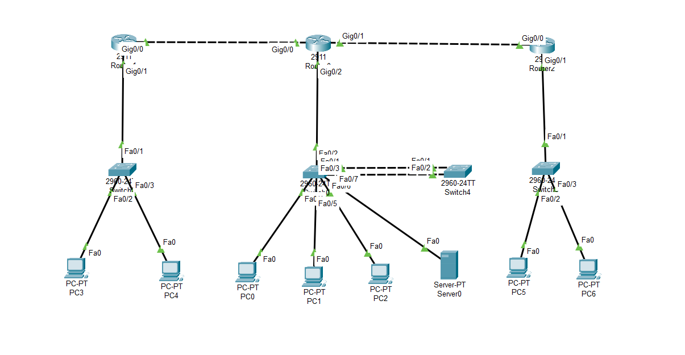

# Enterprise Network Design (CCNA Project)

## 📌 Overview
This project demonstrates the design and implementation of a multi-branch enterprise network using Cisco Packet Tracer.

## 🏗️ Network Topology
- Head Office (R1)
- Branch Office (R2, R3)
- Switches, PCs, Server

## ⚙️ Technologies Used
- VLAN & Inter-VLAN Routing  
- EIGRP  
- DHCP, ACL  
- EtherChannel  
- NTP, Syslog  

## 🔑 Features
- Multi-branch connectivity  
- VLAN segmentation  
- Centralized services  
- Network security  

## 📸 Screenshots

## 👨‍💻 Author
Sanika Shewale
