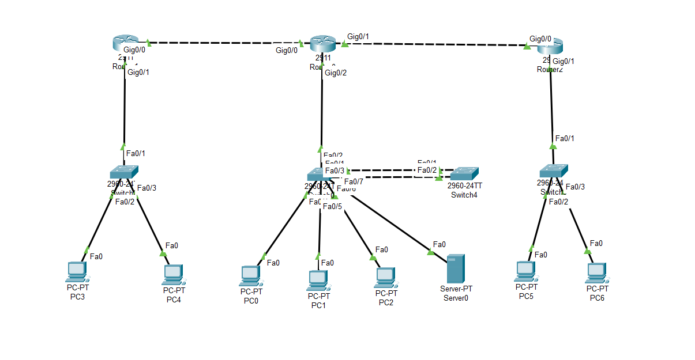
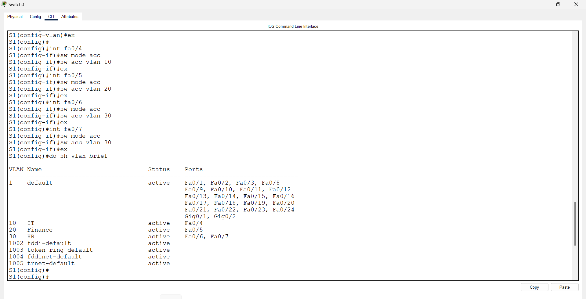
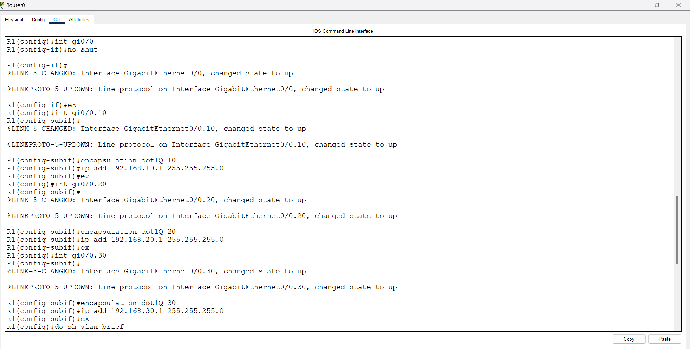
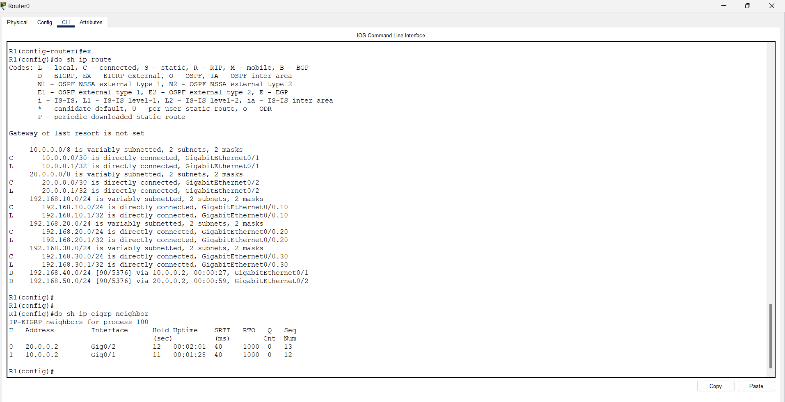
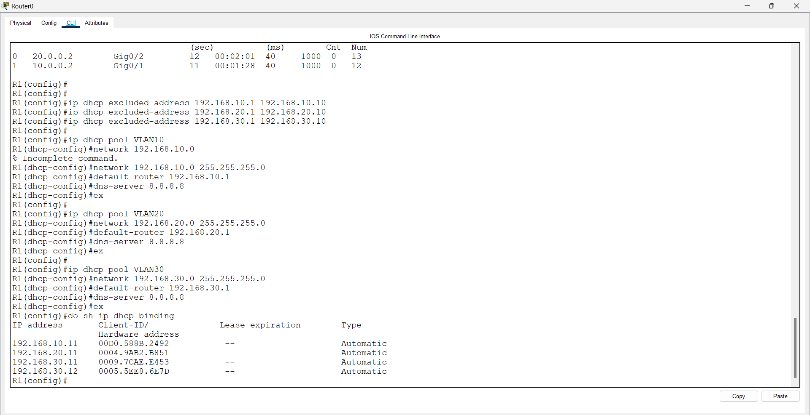
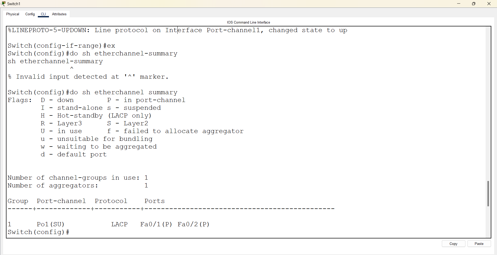
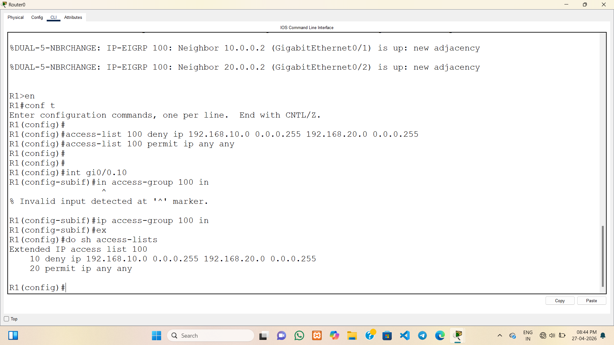
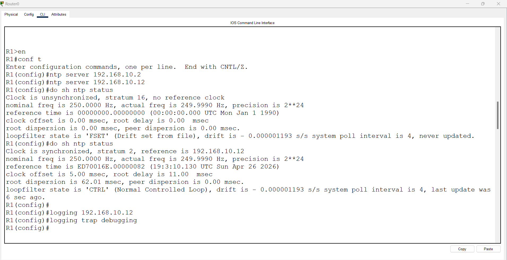
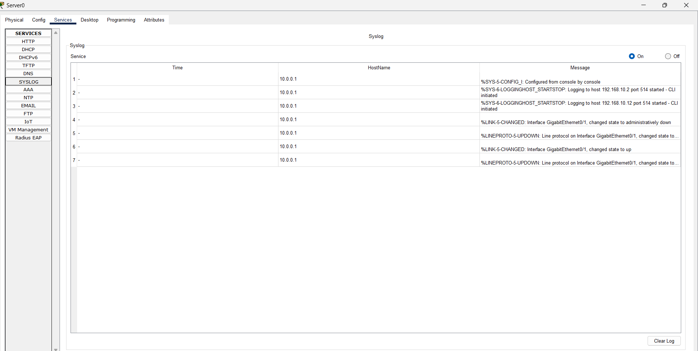
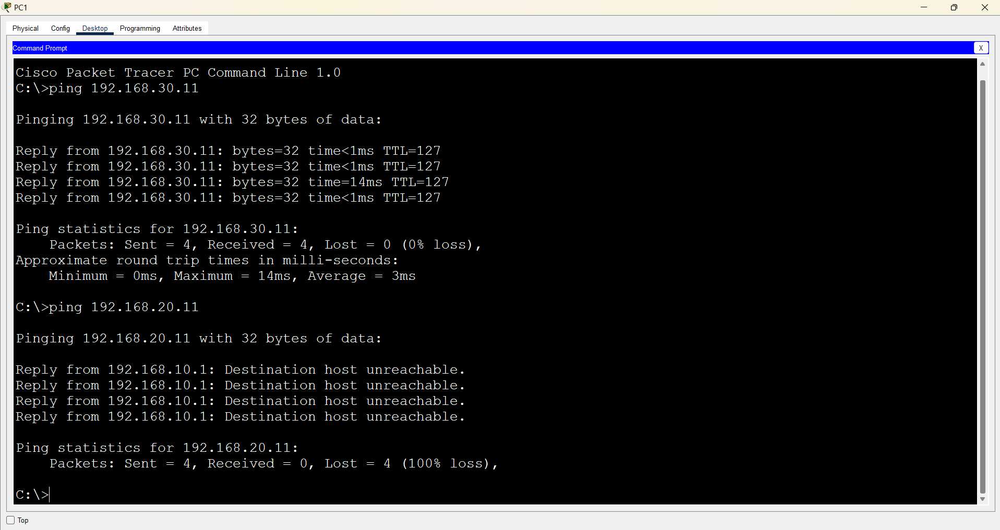

# Enterprise Network Design (CCNA Project)

## 📌 Overview
This project demonstrates the design and implementation of a multi-branch enterprise network using Cisco Packet Tracer.

## 🏗️ Network Topology
- Head Office (R1)
- Branch Office (R2, R3)
- Switches, PCs, Server

## ⚙️ Technologies Used
- VLAN & Inter-VLAN Routing  
- EIGRP  
- DHCP, ACL  
- EtherChannel , STP 
- NTP, Syslog  

## 🔑 Features
- Multi-branch connectivity  
- VLAN segmentation  
- Centralized services  
- Network security  

## 📸 Screenshots

## Enterprise Network Topology

## VLAN Configuration

## Inter-VLAN Routing

## EIGRP Dynamic Routing

## DHCP Configuration

## EtherChannel Configuration

## Access Control List (ACL)

## NTP Configuration

## Syslog Monitoring

## Network Testing & Verification
- Successful communication between VLANs
- EIGRP routing verified
- DHCP IP allocation tested
- ACL traffic filtering validated
- EtherChannel operational
- NTP synchronization successful
- Syslog monitoring verified

## 👨‍💻Author
Sanika Shewale
